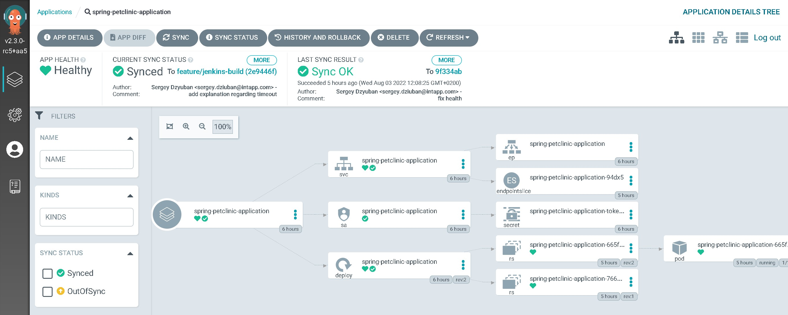

# Jenkins CI for Spring Pet Clinic Application 

## Description 
This sample application was extended with few CI\CD related features:
* Fork for [spring-petclient](https://github.com/SergeyDz/spring-petclinic/tree/feature/jenkins-build) application
* [Jenkinsfile](https://github.com/SergeyDz/spring-petclinic/blob/feature/jenkins-build/Jenkinsfile) for CI build 
* [Dockerfile](https://github.com/SergeyDz/spring-petclinic/blob/feature/jenkins-build/Dockerfile) for the application packaging
* [Helm](https://github.com/SergeyDz/spring-petclinic/tree/feature/jenkins-build/helm/spring-petclinic) for Kubernetes deployment 
* [Argo Application](https://github.com/SergeyDz/spring-petclinic/tree/feature/jenkins-build/helm/spring-petclinic) to deploy the application in AKS

The work was organized in scope of single feature branch with opened [Merge Request](https://github.com/SergeyDz/spring-petclinic/pull/2/files). It will allow to see real diff with all changes was made inside original application repository. 

## Environment 
In scope of this project was user SaaS and PaaS solutions.
* Azure Cloud with AKS cluster
* GitHub repository for the project source code 
* GitHub repository for the gitops deployment
* Argo CD instance running in AKS
* Jenkins instance running in AKS 
* Spring-Petclinic application in AKS
* JFrog Artifactory to maven cache and docker feed
* Sonar Cloud for code analysis 


Links to components: 
* [Jenkins](http://52.142.20.66:8080/)
* [Argo CD](https://52.142.16.113/)
* [JFrog Artifactory](http://example.com/)
* [Sonar Cloud](https://sonarcloud.io/project/overview?id=SergeyDz_spring-petclinic)
* [Spring PetClinic Dev](http://20.121.234.160/)


## CI Features 
Actually CI pipeline for the current project is fully defined inside [Jenkinsfile](https://github.com/SergeyDz/spring-petclinic/blob/feature/jenkins-build/Jenkinsfile) for CI build and [build agent definition](https://github.com/SergeyDz/spring-petclinic/blob/feature/jenkins-build/jenkins.k8s.yaml).


List of CI features:
* [Jenkins Declarative Pipelines](https://www.jenkins.io/doc/book/pipeline/syntax/) are used for Jenkins pipeline definition as flexible and human readable DSL. 
* [Git Version Tool](https://github.com/GitTools/GitVersion) is used to calculate unique app version depending on git state.
* [Kubernetes Jenkins Plugin](https://plugins.jenkins.io/kubernetes/) is used to run build agents as pods inside kubernetes.
* [Artifactory Plugin](https://plugins.jenkins.io/artifactory/) is using to push docker and build info to AF.
* bash script and [dind](https://github.com/jpetazzo/dind) docker image is using to build docker image.
* to resolve dependency from artifactory source only, maven [mirror](https://github.com/SergeyDz/spring-petclinic/tree/feature/jenkins-build/helm/spring-petclinic) feature is used.
* jenkins push build status to Git Hub commits.
* jenkins has build discarder and blocks concurrent builds for the same branch. 
* maven test results saved to jenkins plugin.
* global job timeout defined for 30 minutes to protect from having long-running builds.
* jenkins log output for different command are redirected to *.log files. See them as job artifacts.


## Jenkins configuration 
Jenkins instance deployed in AKS cluster using ArgoCD application, and managed as [GitOps](https://github.com/SergeyDz/argocd-education/tree/main/helm/jenkins).


The only customization managed from Argo CD is plugins setup
```
jenkins: 

  controller:
    serviceType: LoadBalancer
    installPlugins: 
      - "kubernetes:3600.v144b_cd192ca_a_"
      - "workflow-aggregator:590.v6a_d052e5a_a_b_5"
      - "git:4.11.3"
      - "configuration-as-code:1429.v09b_044a_c93de"
      - "artifactory:3.17.0"
      - "blueocean:1.25.5"
      - "build-pipeline-plugin:1.5.8"
      - "pipeline-stage-view:2.24"
      - "pipeline-maven:1161.v89a_7dcec5d31"
      - "maven-plugin:3.19"
      - "github:1.34.5"
      - "htmlpublisher:1.30"
      - "sonar:2.14"
      - "pipeline-utility-steps:2.13.0"
      - "build-discarder:60.v1747b0eb632a"
```

_Note_: all secrets and settings of plugins was made manually using Jenkins UI. 


## Artifactory JFrog Configuration
JFrog Artifactory us using as a package source for the application build and deployment.

### Docker
Dockers are pushed and pulled from the artifactory docker feeds. 
* docker-dev for some temporary storage with high retention
* docker-live to promote and store production-ready artifacts

### Maven 
For performance and security purposes, maven central and spring package repositories was configured to use Artifactory as a cached proxy. 


See diagram with repositories structure


All artifacts are scanning by xray. 

## Deployment 
Application [deployed](http://20.121.234.160/) to AKS kubernetes cluster. 
* [Helm](https://github.com/SergeyDz/spring-petclinic/tree/feature/jenkins-build/helm/spring-petclinic) for Kubernetes deployment 
* [Argo Application](https://github.com/SergeyDz/spring-petclinic/tree/feature/jenkins-build/helm/spring-petclinic) to deploy the application in AKS


## Known issues
* Xray scan fails with strange 403 error.
* Sonar Quality Gate was not added to the job. 
* Automatic deployment to dev was not implemented as part of this pipeline.
* Hook to start build automatically on each commit was not made.
* Jenkins configuration as a code plugin and kubernetes secrets was not used. 

<hr/>